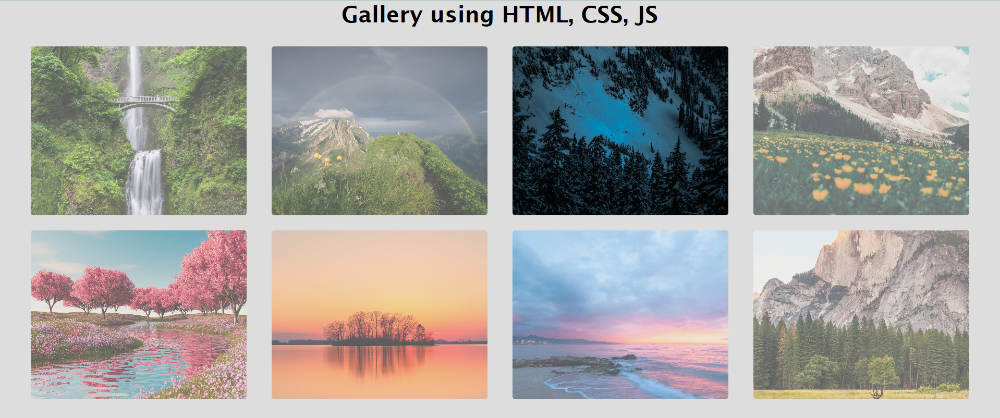

# 🖼️ Interactive Image Gallery

A fully interactive image gallery built using **HTML**, **CSS**, and **JavaScript**, completed as part of the **CodeAlpha Frontend Development Internship**.

---

## 🚀 Features

- 📸 Display of high-quality images using Flexbox
- 🔍 Image preview in fullscreen overlay
- ❌ Easy-to-use close functionality (via button or overlay click)
- 🎨 Smooth transitions and hover effects

---

## 🛠️ Tech Stack

- **HTML5**
- **CSS3** (Flexbox, transitions)
- **Vanilla JavaScript** (DOM events and manipulation)

---

## 📁 Project Structure

gallery-project/
├── index.html
├── style.css
├── script.js
├── Gallery_screenshot1.png
├── Gallery_screenshot2.png
└── README.md
---

## 💡 How It Works

- The gallery displays thumbnails using a flexible layout.
- Clicking on an image triggers an overlay with a fullscreen preview.
- Clicking the close (×) button or anywhere outside the image closes the preview.

---

## 🧠 Learning Outcome

Through this project, I improved:
- My **DOM manipulation** skills in JavaScript.
- My understanding of **design layouts** using **Flexbox**.
- The use of **JavaScript events** to create interactive features.

---

## 📬 Contact

Want to connect?

- LinkedIn: https://www.linkedin.com/in/harsh-malap-?utm_source=share&utm_campaign=share_via&utm_content=profile&utm_medium=android_app
- GitHub: https://github.com/malapharsh24-developer

---

## 🙌 Acknowledgement

This project was completed as a task under the **CodeAlpha Frontend Development Internship Program**.

---

